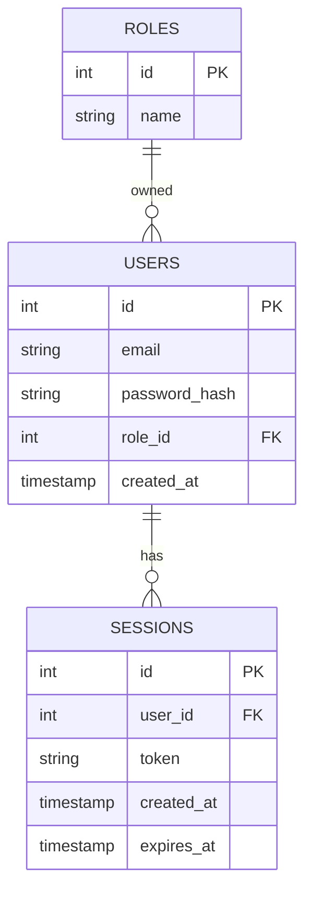

```mermaid

erDiagram

    ROLES ||--o{ USERS : "owned"
    USERS ||--o{ SESSIONS : "has"

    ROLES {
        int id PK
        string name
    }

    USERS {
        int id PK
        string email
        string password_hash
        int role_id FK
        timestamp created_at
    }

    SESSIONS {
        int id PK
        int user_id FK
        string token
        timestamp created_at
        timestamp expires_at
    }

```
