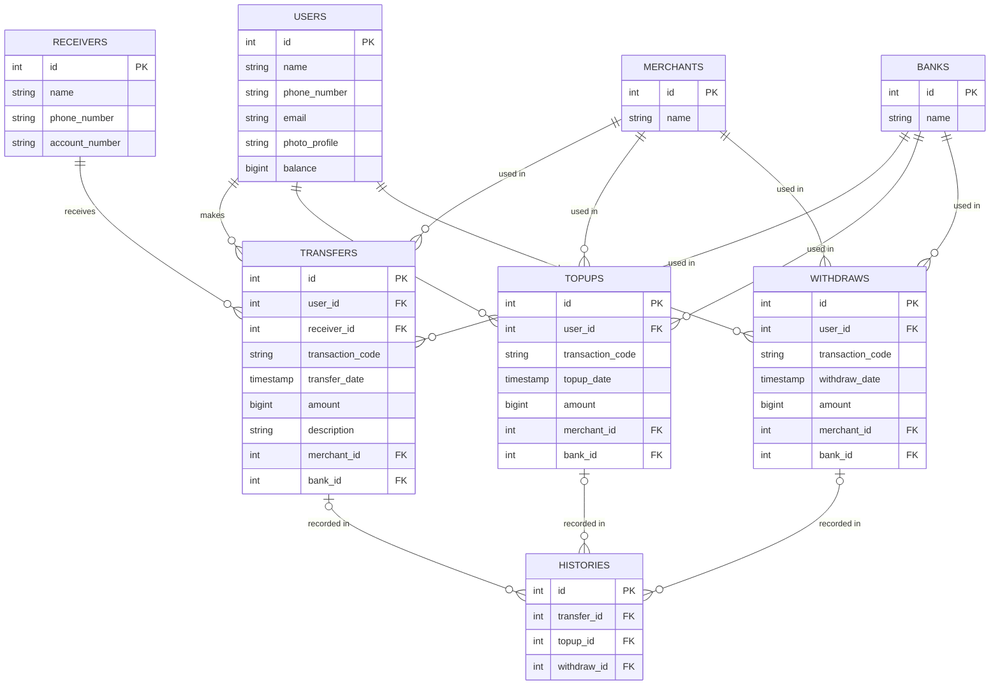

```mermaid

erDiagram

USERS ||--o{ TRANSFERS : "makes"
USERS ||--o{ TOPUPS : "makes"
USERS ||--o{ WITHDRAWS : "makes"
RECEIVERS ||--o{ TRANSFERS : "receives"
MERCHANTS ||--o{ TRANSFERS : "used in"
MERCHANTS ||--o{ TOPUPS : "used in"
MERCHANTS ||--o{ WITHDRAWS : "used in"
BANKS ||--o{ TRANSFERS : "used in"
BANKS ||--o{ TOPUPS : "used in"
BANKS ||--o{ WITHDRAWS : "used in"
TRANSFERS |o--o{ HISTORIES : "recorded in"
TOPUPS |o--o{ HISTORIES : "recorded in"
WITHDRAWS |o--o{ HISTORIES : "recorded in"

USERS {
  int id PK
  string name
  string phone_number
  string email
  string photo_profile
  bigint balance
}

RECEIVERS {
  int id PK
  string name
  string phone_number
  string account_number
}

BANKS {
  int id PK
  string name
}

MERCHANTS {
  int id PK
  string name
}

TRANSFERS {
  int id PK
  int user_id FK
  int receiver_id FK
  string transaction_code
  timestamp transfer_date
  bigint amount
  string description
  int merchant_id FK
  int bank_id FK
}

TOPUPS {
  int id PK
  int user_id FK
  string transaction_code
  timestamp topup_date
  bigint amount
  int merchant_id FK
  int bank_id FK
}

WITHDRAWS {
  int id PK
  int user_id FK
  string transaction_code
  timestamp withdraw_date
  bigint amount
  int merchant_id FK
  int bank_id FK
}

HISTORIES {
  int id PK
  int transfer_id FK
  int topup_id FK
  int withdraw_id FK
}

```
