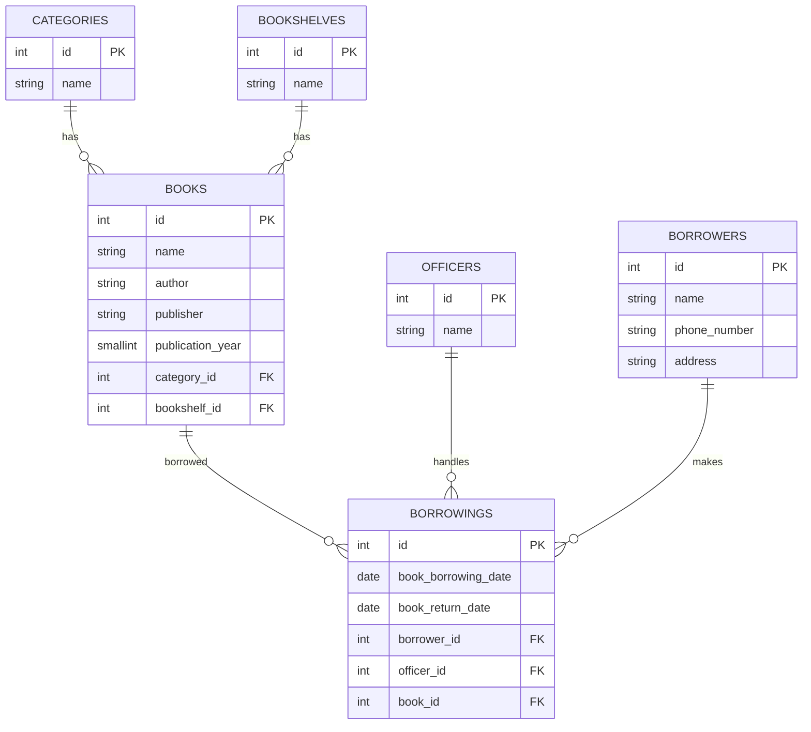

```mermaid

erDiagram

CATEGORIES ||--o{ BOOKS : "has"
BOOKSHELVES ||--o{ BOOKS : "has"
BOOKS ||--o{ BORROWINGS : "borrowed"
OFFICERS ||--o{ BORROWINGS : "handles"
BORROWERS ||--o{ BORROWINGS : "makes"

CATEGORIES {
  int id PK
  string name
}

BOOKSHELVES {
  int id PK
  string name
}

BOOKS {
  int id PK
  string name
  string author
  string publisher
  smallint publication_year
  int category_id FK
  int bookshelf_id FK
}

OFFICERS {
  int id PK
  string name
}

BORROWERS {
  int id PK
  string name
  string phone_number
  string address
}
BORROWINGS {
  int id PK
  date book_borrowing_date
  date book_return_date
  int borrower_id FK
  int officer_id FK
  int book_id FK
}

```
